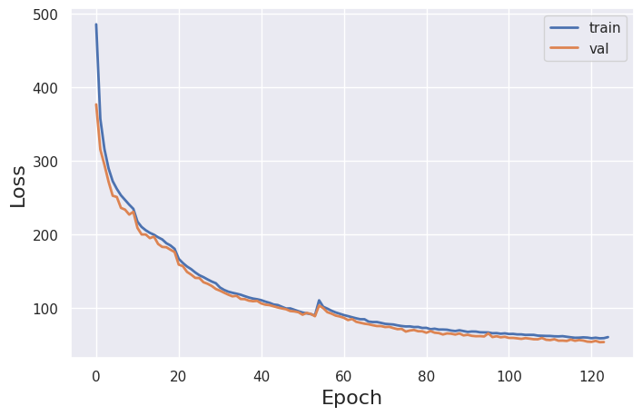
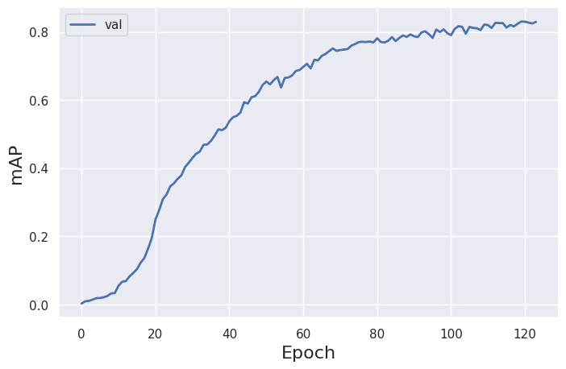
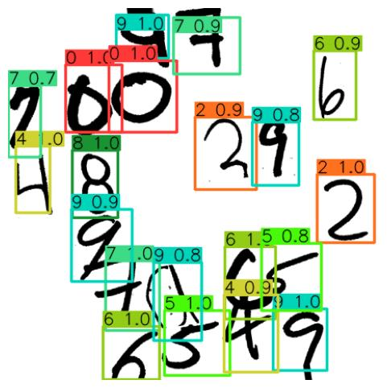
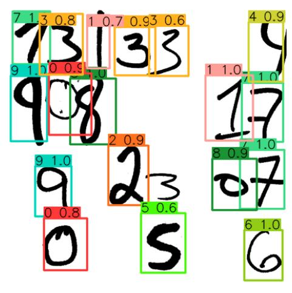
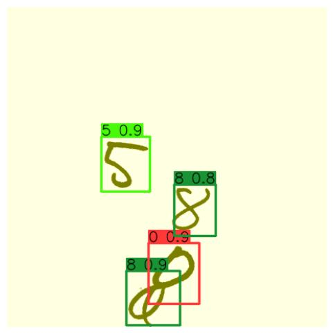
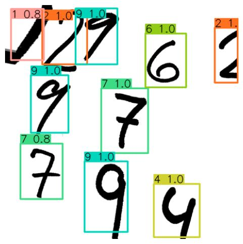
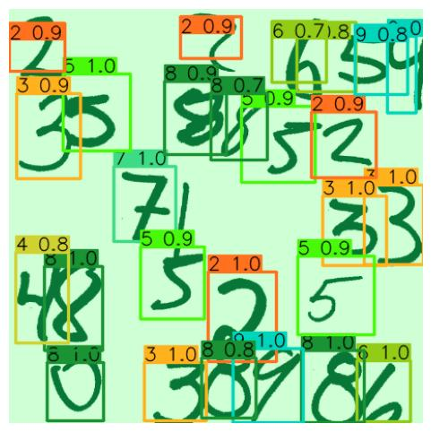
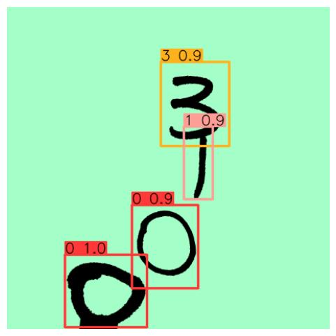
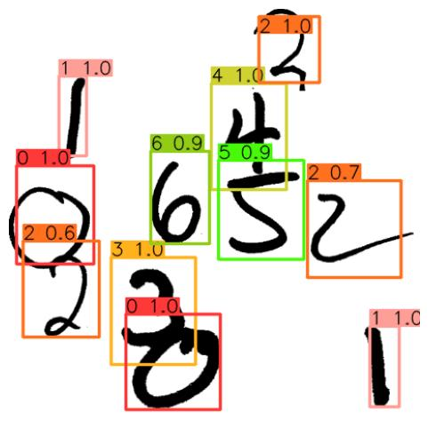

# About
PyTorch implementation of [YOLOv1](https://arxiv.org/pdf/1506.02640.pdf) architecture

# Repo structure
```
.
├── datasets						                # datasets files (images and labels)
├── img						                        # README images
├── mlruns						                    # mlflow data for experiments (artifacts and metrics)
├── notebooks						                # some jupyter notebooks
├── results						                    # experiments results (artifacts and metrics)
└── src
    ├── bin						                    # runnable python scripts
    │   ├── data					                # scripts related to data creation
    │   │   ├── parse_voc_to_yolo.py			    # parse VOC dataset to YOLO format
    │   │   ├── prepare_HWD+_for_classification.py	# create HWD+ data for classification task
    │   │   └── prepare_HWD+_for_detection.py		# create HWD+ data for detection task
    │   ├── detect.py					            # run trained model on test data 
    │   ├── train_classifier.py			            # train classifier 
    │   └── train_detector.py				        # train detector
    ├── data						
    │   ├── dataset.py					            # classification and detection PyTorch datasets
    │   └── transforms.py				            # transforms used for training
    ├── logging
    │   ├── loggers.py					            # logger classes (for mlflow logging)
    │   ├── monitoring.py				            # CPU and GPU monitoring
    │   └── pylogger.py				                # nicely colored terminal logger
    ├── model
    ├── backbones.py				                # YOLO backbones
    │   ├── classifier.py				            # classifier module
    │   ├── detector.py				                # detector module
    │   ├── helpers.py					            # helper classes (e.g. CNNBlock)
    │   ├── loss.py					                # detector loss function
    │   ├── module.py					            # wrapper for training (similar to PyTorch Lightning)
    ├── utils
    │   ├── config.py					            # config constants
    │   ├── model.py					            # model related utils
    │   ├── ops.py					                # boxes related operations
    │   └── utils.py
    ├── visualization.py				            # boxes plotting
    └── metrics.py					                # MAP calculation
```

# Details
Model training is split into two parts:
1. Train classifier using first conv layers as backbone (`yolov1` or `yolov1-tiny`)
2. Train object detector using classifier backbone

# How to train the model?
1. Place your data inside datasets directory with the following structure:
```
.
└── datasets                                        # directory with all datasets
    ├── {detection_dataset_name}                    # directory for specific detection dataset
    |   ├── images                                  # directory with splits data
    |   |   ├── train
    |   |   |   ├── {filename_0}.{png/jpg/jpeg}        
    |   |   |   ├── ...
    |   |   |   └── {filename_K}.{png/jpg/jpeg}
    |   |   ├── val
    |   |   |   ├── {filename_0}.{png/jpg/jpeg}
    |   |   |   ├── ...
    |   |   |   └── {filename_L}.{png/jpg/jpeg}
    |   |   └── test                                # optional test data for detection
    |   ├── labels                                  # directory with splits labels (YOLO format)
    |   |   ├── train
    |   |   |   ├── {filename_0}.txt
    |   |   |   ├── ...
    |   |   |   └── {filename_K}.txt
    |   |   ├── val
    |   |   |   ├── {filename_0}.txt
    |   |   |   ├── ...
    |   |   |   └── {filename_L}.txt
    |   |   └── test                                # optional test data for detection
    |   └── labels.txt                              # txt file with class names for each index
    └── {classification_dataset_name}               # directory for specific classification dataset
        ├── images                                  # directory with splits data
        |   ├── train
        |   |   ├── {filename_0}.{png/jpg/jpeg}        
        |   |   ├── ...
        |   |   └── {filename_K}.{png/jpg/jpeg}
        |   ├── val
        |   |   ├── {filename_0}.{png/jpg/jpeg}
        |   |   ├── ...
        |   |   └── {filename_L}.{png/jpg/jpeg}
        |   └── test                                # optional test data for detection
        ├── labels                                  # directory with splits labels (single int per file)
        |   ├── train
        |   |   ├── {filename_0}.txt
        |   |   ├── ...
        |   |   └── {filename_K}.txt
        |   ├── val
        |   |   ├── {filename_0}.txt
        |   |   ├── ...
        |   |   └── {filename_L}.txt
        |   └── test                                # optional test data for detection
        └── labels.txt                              # txt file with class names for each index
```
2. Run mlflow server locally
```
mlflow server --default-artifact-root ./mlruns/ --backend-store-uri ./mlruns/ --host 0.0.0.0       
```
3. Set `CONFIG` parameters inside `src/bin/train_classifier.py` and train the classifier using {classification_dataset_name} dataset
```
python src/bin/train_classifier.py
```
3. Set `CONFIG` parameters inside `src/bin/train_detector.py` (especially the `classifier_run_id` field to load classifiers backbone weight from mlflow run) and train the detector  using {detection_dataset_name} dataset
4. Set `RUN_ID` field (mlflow run_id of detectors run) inside `src/bin/detect.py` to load detector weights and run detection
```
python src/bin/detect.py
```

# Example results for the handwritten digits detection:
## Dataset
[HWD+](https://www.ncbi.nlm.nih.gov/pmc/articles/PMC9702948/) dataset was used to create the data for classifier and detector training (more about dataset creation in [my YOLOv8 project](https://github.com/thawro/yolov8-digits-detection#yolo_hwd)).

## Training curves
Train and validation losses


Validation mAP (~0.83)


## Predictions on images from the test set









